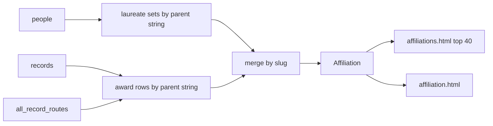

## Goals

From `/affiliations/`, each listed institution MUST open a detail page that lists every award recorded against that institution, ordered by date, with links to winner pages.

## Background

The static site already ranks institutions at `/affiliations/` (`website/templates/affiliations.html`, planned in `build.py:884-898`). Names are plain text — not links. Country ranking is the parallel pattern: `/countries/` plus one detail page per place (`country.html`, `build.py:870-883`) carrying a people list.

Affiliation ranking today (`plan_places`, `build.py:446-488`) counts **distinct laureates** per parent `affiliation_name`, nested under optional `affiliation_sub_name` units. The index still truncates to `AFFILIATION_ROWS = 40` (`build.py:55`). Compound strings (`A; B`) stay one name; they are not split.

Person pages already list awards oldest-first (`plan_people` `build.py:537-540`) using `.person-awards` (`person.html`). That list shape is the layout target for institution awards.

Live data has at least two parent pairs that `slugify` to the same slug (casing only): Caltech and UCLouvain. Fail-closed like countries would block the full site build; this feature folds those pairs instead.

Prerequisite: `docs/datasets-affiliation-sub-name-20260725.md` (parent vs unit column).

## Assumptions

1. **One page per routeable parent** — route `/affiliations/{slug}/` from `slugify(affiliation_name)`. Units are not separate pages; they stay labels on award rows when nonblank. **Load-bearing.**
2. **All parents get pages** — every non-blocklisted institution produced by `plan_places`, not only the top 40 on the index (full detail set; long-tail discoverability is sitemap / direct URL until a later index change). Ranked bar chart stays top 40.
3. **Membership by stored parent string, then folded by slug** — awards join on exact `affiliation_name` first; parents that share a slug are merged into one page (see Design). Compound `;` strings are not split across institutions.
4. **List awards, not people** — one row per award record. Index `count` stays distinct-laureate union; detail `len(awards)` may be larger. **Load-bearing.**
5. **Award list source is raw `records`** — not `people`. `plan_people` drops blank-QID rows. Call `plan_places` only after `all_record_routes` is complete (same point as `plan_people`). **Load-bearing.**
6. **Parent universe = awards ∪ people keys** — build the Affiliation set from award-path parents first, then attach laureate counts from the people path so no-QID-only parents still get a page.
7. **Sort** — year ascending, then `award_record_id` (`build.py:539`).
8. **Row fields** — year, laureate name → winner route, prize name, category if nonblank, `affiliation_sub_name` if nonblank. No motivation. Winner route is intentional (works without QID; same as prize trees)—not the person hub.
9. **Slug fold, not fail** — when two distinct parent strings share a slug, one page: display `name` = spelling with the most awards (tie-break lexicographic); merge awards and laureate sets; merge unit counters. No short aliases (`MIT` is whatever the stored string slugifies to). Near-duplicates that do **not** collide on slug stay separate pages (data hygiene, not builder work).
10. **Blocklist** — `AFFILIATION_BLOCKLIST` (`Freelance`) never gets a page or index row.
11. **No database schema change** — static build only. Optional later data cleanup of casing twin names is out of this change.
12. **Sitemap** — each page is a normal `PageJob`.
13. **Tests** — extend `tests/test_build_website.py`.

## Scope

| Path | Change |
|------|--------|
| `website/build.py` | Extend `Affiliation`; plan awards + slug fold; emit detail jobs; link index |
| `website/templates/affiliations.html` | Link each name to its detail route |
| `website/templates/affiliation.html` | **New** — institution header + award list |
| `website/static/style.css` | Only if `.person-awards` reuse fails (~0–10 lines) |
| `tests/test_build_website.py` | Order, no-QID, outside top-N, blocklist, slug fold, index href |

Rough size: ~110–150 LOC across 4–5 files.

```text
/affiliations/                                      index (top 40, linked)
/affiliations/harvard-university/                   awards oldest → newest
/affiliations/massachusetts-institute-of-technology/
```



## Design

### Data shape

```python
@dataclass(frozen=True, slots=True)
class Affiliation:
    name: str
    slug: str
    route: str
    count: int  # distinct laureates after fold
    units: tuple[tuple[str, int], ...]
    awards: tuple[tuple[AwardRecord, str], ...]  # oldest first
```

### Planning (`plan_places`)

```text
plan_places(people, records, record_routes) -> (countries, affiliations)
```

Call order: only after `all_record_routes` is fully built. Missing route key → `BuildFailure` with `award_record_id`.

1. **People path (count):** for each person, each award with nonblank non-blocklisted `affiliation_name`, add `person.qid` to `laureates[name]` and, if sub-name set, to `units[name][sub]`.
2. **Awards path (list):** for each record with nonblank non-blocklisted `affiliation_name`, append `(record, record_routes[id])` to `awards_by_name[name]`.
3. **Parent keys:** `names = set(awards_by_name) | set(laureates)`.
4. **Slug fold:** group names by `slugify(name)`. For each slug group:
   - `display = max(group, key=lambda n: (len(awards_by_name.get(n, ())), n))`  # most awards, then name
   - union laureate qids and unit maps; concatenate awards lists
   - sort awards `(_year_prefix(year, id), award_record_id)` ascending
   - `route = f"{AFFILIATIONS_ROUTE}{slug}/"`
5. Sort affiliations by `(-count, name)` as today.

Countries path unchanged.

### Site plan (`create_site_plan`)

After affiliations index job (`build.py:884-898`):

- One `affiliation.html` job per full `affiliations` list entry.
- Title: `"{name}: laureate awards"`.
- Description: `_clamp` of award count, year span via `_year_prefix` min/max (or single year), and name.
- Breadcrumbs: Home → Institutions → name.
- Context: `affiliation=…` only (no `.units` block on detail unless already free — index keeps units).

Index still gets `affiliations[:AFFILIATION_ROWS]` with `.route` for links. Do not add unused `SitePlan` fields.

### Templates

**`affiliations.html`:**

```html
<a href="{{ href(affiliation.route) }}">{{ affiliation.name }}</a>
```

Units stay plain text.

**`affiliation.html`** (new):

```html


<header class="page-intro">
  <p class="eyebrow">Institution</p>
  <h1>{{ affiliation.name }}</h1>
  <p>{{ affiliation.count }} {{ "laureate" if affiliation.count == 1 else "laureates" }} · {{ affiliation.awards | length }} recorded awards.</p>
</header>
<section>
  <h2>Awards</h2>
  <ol class="person-awards">
    
    <li>
      <p class="person-award-year">{{ record.year }}</p>
      <div>
        <h3><a href="{{ href(route) }}">{{ record.full_name }}</a></h3>
        <p>{{ record.prize_name }} — {{ record.category }} · {{ record.affiliation_sub_name }}</p>
      </div>
    </li>
    
  </ol>
</section>
<p><a href="{{ href(affiliations_route) }}">All institutions</a></p>

```

Add `"affiliation.html"` to `TEMPLATES` (`build.py:36-49`). Reuse `.person-awards` CSS.

### Out of scope

- Per-unit pages; `;` split; expanding index past 40; maps; explorer; winner→institution reverse links; DB casing cleanup.

## Behavior / Acceptance

### Requirement: Index links

#### Scenario: Top institution
- WHEN `/affiliations/` is opened
- THEN each top-40 parent name is an anchor to `/affiliations/{slug}/`
- AND unit rows are not links

### Requirement: Detail award list

#### Scenario: Harvard
- WHEN `/affiliations/harvard-university/` is built
- THEN every award whose parent folds to that page appears once
- AND rows are year ascending, then `award_record_id`
- AND each name links to that award's winner page
- AND nonblank `affiliation_sub_name` shows on the row

#### Scenario: Blank laureate QID
- WHEN a matching award has blank `laureate_wikidata_qid`
- THEN it still appears and links to its winner route

#### Scenario: Rank vs list size
- WHEN 93 laureates and 100 award rows fold to one page
- THEN index `count` is 93 and intro includes both counts

### Requirement: Coverage outside top 40

#### Scenario: Rank 41
- WHEN a parent is outside `AFFILIATION_ROWS`
- THEN its detail page exists
- AND it is absent from the index list

### Requirement: Slug fold

#### Scenario: Casing twins
- WHEN `"California Institute of Technology"` and `"California institute of Technology"` both exist
- THEN one page at `/affiliations/california-institute-of-technology/`
- AND awards from both spellings appear
- AND build does not raise

### Requirement: Blocklist

#### Scenario: Freelance
- WHEN `affiliation_name = 'Freelance'`
- THEN no page and no index row

## Verification

```bash
uv run pytest tests/test_build_website.py
```

Fixture must cover: two awards same parent oldest-first; blank QID listed; parent outside a lowered `AFFILIATION_ROWS` still paged; `Freelance` absent; index `href` to route; two strings same slug merge without `BuildFailure`.

```bash
uv run website/build.py --base-url https://example.org/awards/
```
