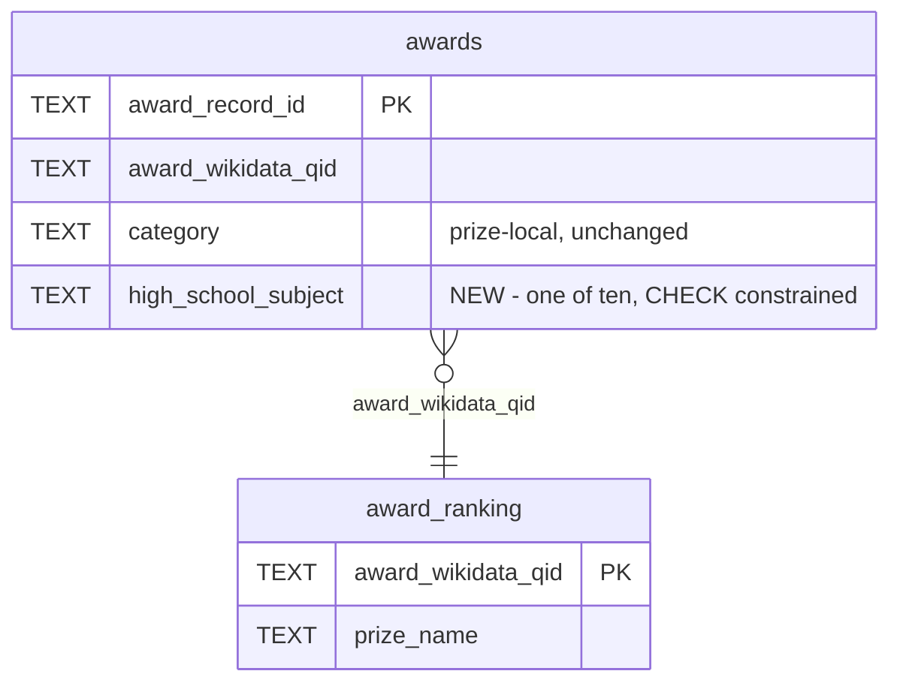

# Subject taxonomy: browse awards by school class

## Goals

Give the site a **subject** axis — ten courses drawn from the US high school curriculum — so a visitor can pick Biology
or Physics and see who won what in it, and so every award on the site carries a tag saying which class the work belongs
to.

Today the only cross-prize axes are person, country, and institution. Subject is the axis a student arrives with.

Every label MUST be a course a US student would recognise from their own transcript, not an academic field and not a
department. Nine of the ten have a College Board AP equivalent (§3).

## Background

`awards.sqlite3` holds one flat `awards` table: 3091 rows, 30 columns, one row per (award × laureate).

Its `category` column (`website/build.py:86`) is **prize-local**, not a taxonomy:

- 91 distinct values, blank on 655 rows.
- Japan Prize alone contributes 67 bespoke, one-off categories — `Molecular Recognition and Dynamics in Bioscience`,
  `Science and Technology of Harmonious Co-Existence` — that read as motivation summaries rather than fields. It is
  already special-cased out of category routing by `YEAR_ROUTED_PRIZES` (`website/build.py:71`).
- The same field appears under different names across prizes: Nobel `Medicine`, Crafoord `Biosciences`, Shaw
  `Life Science and Medicine`, Lasker `Albert Lasker Basic Medical Research Award` are all Biology.

So there is no way to ask "who won for biology" across prizes. A new, small, closed vocabulary is required; `category`
is left exactly as it is.

The site's existing route families are declared at `website/build.py:55-60` — `/people/`, `/countries/`,
`/affiliations/`, `/explorer/` — with prize → category → year → winner pages generated in `create_site_plan`
(`website/build.py:728-1216`). Subject pages join that set.

**Why a column and not a lookup table.** An earlier draft of this spec used a `(award_wikidata_qid, category)` rule
table plus an override table, on the grounds that this database has suffered from denormalisation — 175 laureates carry
contradictory birth dates because a per-*person* fact is repeated across each of that person's award rows. That argument
does not apply here. Subject is a per-**award** fact: one row, one value, nothing repeated, so no drift is possible.
The column is also what makes Kyoto tractable (§2.1) instead of requiring a second table. Since
`8617610 chore: delete the CSV importer, SQLite is the source of truth`, the database is authoritative and hand
maintained, so there is no import path that would silently drop the column.

A separate, **unstarted** proposal exists to normalise `awards` into `awards` / `laureates` / `affiliations` and drop
derivable columns. It is **not** in scope. `high_school_subject` belongs on the award in that design too, so it survives the split.

## Assumptions

1. **Load-bearing.** Subject is a property of the **award**, never of the person. Each of the 3091 rows resolves to
   exactly one subject. A laureate with awards in two subjects genuinely has two — Adi Shamir's Turing Award is Computer
   Science and his Wolf Prize is Mathematics — and the site must show both without implying either is "his" subject.
2. **Load-bearing.** The vocabulary is exactly **ten** subjects, each a course in the US high school curriculum, and it
   does not grow without a code change. A database `CHECK` constraint enforces this (§1), verified against SQLite.
   Rejected on curriculum grounds: `Geography`, which in the US means AP Human Geography — a Social Studies course about
   population, migration and urbanisation. The 40 awards in this bucket are seismology, oceanography, geology and
   climate physics, so `Earth Science` is the correct US course. (Under a UK curriculum, Geography would be right.)
3. **Load-bearing.** A blank subject is a **failure**, never a default. `scripts/set_award_subjects.py` exits non-zero
   listing any record it cannot classify, and `build_site` raises `BuildFailure` on any blank. Two independent loud
   failures, so "no award left unclassified" is verifiable rather than aspirational.
4. `high_school_subject` is a **new** column. It does not reuse `remarks` (3 non-blank rows of 3091) or `field_language` (626
   non-blank): overloading a column whose name means something else is how a schema stops being readable. Dropping
   `remarks` is a separate cleanup, not part of this work.
5. 5 award rows have a blank `laureate_wikidata_qid` and therefore get no person page (`website/build.py:685-693`).
   They count toward a subject's **award** total but never appear in its **laureate** list. The two numbers on a subject
   page are therefore not required to agree, and the page must not imply they do.
6. A person's tags are derived — the distinct subjects across their awards, never stored. Measured: 2251 laureates have
   1 subject, 113 have 2, 3 have 3. Three tags is the maximum the CSS must accommodate.
7. Kyoto `Basic Sciences` subjects are resolved **once, by hand**, from the parenthetical in `motivation`
   (§Appendix B). Neither `website/build.py` nor the population script parses motivation text.

## Scope

**12 files — 4 new, 8 modified. ~415 lines.**

| File | New? | Lines | What |
|---|---|---|---|
| `scripts/set_award_subjects.py` | new | ~110 | Populate `awards.high_school_subject`, idempotent |
| `website/build.py` | mod | +70 | Validate, plan subject pages, derive person tags |
| `website/templates/subjects.html` | new | ~28 | Index of ten subjects |
| `website/templates/subject.html` | new | ~34 | One subject, laureates ranked |
| `website/templates/base.html` | mod | +1 | Nav link |
| `website/templates/index.html` | mod | +6 | Tags in two blocks |
| `website/templates/people.html` | mod | +3 | Tags |
| `website/templates/person.html` | mod | +6 | Tags |
| `website/templates/winner.html` | mod | +3 | Tag |
| `website/static/style.css` | mod | ~28 | `.subject-badge`, `.subject-cards` |
| `tests/test_build_website.py` | mod | +55 | Fixture column + page tests |
| `tests/test_set_award_subjects.py` | new | ~70 | Population contract |

Out of scope: the `awards` normalisation proposal; any change to `category` values; dropping `remarks`; tags on
`prize.html`, `category.html`, `year.html`, `country.html`, `affiliation.html`.

## 1. Schema change

One column on `awards`. No new tables.

```sql
ALTER TABLE awards ADD COLUMN high_school_subject TEXT NOT NULL DEFAULT '' CHECK (high_school_subject IN (
  '', 'Biology', 'Physics', 'Chemistry', 'Mathematics', 'Computer Science',
  'World History', 'English Literature', 'Fine Arts', 'Economics', 'Earth Science'));
```

The column is named `high_school_subject`, not `subject`, because that is what it holds: a course from one specific
curriculum, chosen from a closed list — not a general academic field. The name matches the verbose style already in this
table (`affiliation_wikidata_qid`, `citizenship_countries`, `biographical_note`). The public route and nav label stay
`/subjects/` and "Subjects", which read better on the page.

**Verified against SQLite**: `ALTER TABLE ... ADD COLUMN` accepts a `CHECK` constraint, and it is enforced — an
`UPDATE ... SET high_school_subject='Geography'` fails with `CHECK constraint failed`, while a valid value is accepted. This is what
closes the vocabulary at the storage layer, so no code has to duplicate the list to keep it closed.

`''` is permitted by the `CHECK` only because `ADD COLUMN` on a `NOT NULL` column requires a default. It is a transient
state between the `ALTER` and the population run, and Assumption 3 makes it fatal everywhere else.



Take a timestamped backup before the `ALTER`, per the convention already visible in the repo root
(`awards.sqlite3.YYYYMMDD-HHMMSS.<label>.bak`). Label it `pre-subject`.

## 2. Populating the column — `scripts/set_award_subjects.py`

A single idempotent script. Re-running it MUST produce no change.

```
scripts/set_award_subjects.py --database awards.sqlite3 [--dry-run]
```

Structure, following the house idiom of `scripts/load_award_ranking.py:96-131`:

- `SUBJECTS` — the ten-name tuple, the vocabulary's single source of truth in code (§3).
- `KYOTO` — `dict[str, str]`, the 42 record IDs from Appendix B.
- `classify(record) -> str | None` — the ladder in Appendix A. Returns `None` when nothing matches.
- `set_subjects(database, dry_run)`:
  - `BEGIN IMMEDIATE`; `ALTER TABLE` if the column is absent (mirroring the `PRAGMA table_info` guard at
    `scripts/load_award_ranking.py:106-110`).
  - `KYOTO` is applied **after** the ladder, so it wins.
  - Any record left unclassified is collected, **not** silently defaulted. If the list is non-empty: roll back, print
    one line per record, exit 1.
  - `PRAGMA integrity_check` before commit; roll back on any exception.
- Log line: `award_subjects set=<n> unchanged=<n> dry_run=<bool>`, plus one
  `award_subjects unclassified record_id=<id> qid=<qid> category=<category>` line per failure.

### 2.1 Why this is simpler than the alternative

Kyoto Prize `Basic Sciences` is one category covering four real fields, recorded only in the motivation text. A
`(qid, category)` rule table cannot express it — every rule table design needed a second override table keyed by
`award_record_id`, with precedence between them. A per-award column expresses it directly: those 42 rows simply hold
their own correct values. The gap that drove the two-table design does not exist here.

The cost is that the mapping rationale lives in the script rather than in a reviewable data file. That is acceptable
because the script is committed, deterministic, and re-runnable, and because a new unclassifiable award fails loudly
(Assumption 3) rather than inheriting a plausible-looking default.

## 3. The ten subjects

```python
SUBJECTS = ("Biology", "Physics", "Chemistry", "Mathematics", "Computer Science",
            "World History", "English Literature", "Fine Arts", "Economics", "Earth Science")
```

Each is a course in the US high school curriculum, not an academic field and not a department. The distribution over all
3091 records:

| Subject | Awards | Laureates | US course | Absorbs |
|---|---:|---:|---|---|
| Biology | 1394 | 951 | AP Biology | medicine, life sciences, agriculture, physiology, ecology |
| Physics | 519 | 432 | AP Physics | astronomy, astrophysics, cosmology |
| Chemistry | 262 | 247 | AP Chemistry | |
| Mathematics | 243 | 163 | AP Calculus / AP Statistics | |
| Computer Science | 166 | 151 | AP Computer Science A | engineering, materials, information technology |
| World History | 143 | 140 | AP World History | peace, diplomacy, human rights |
| English Literature | 123 | 123 | AP English Literature and Composition | linguistics |
| Fine Arts | 102 | 98 | Fine Arts (visual, music, theater) | architecture, film, philosophy |
| Economics | 99 | 99 | AP Macroeconomics / Microeconomics | |
| Earth Science | 40 | 37 | Earth & Space Science | geology, seismology, oceanography, climate |
| **Total** | **3091** | | | |

Award counts sum to exactly 3091 (Assumption 3). Laureate counts do **not** sum to a site total: 116 laureates hold
awards in more than one subject and are counted in each (Assumption 6).

`Mathematics` is kept as the department-level name rather than `Calculus` or `Statistics`: these 243 awards span
topology, number theory and combinatorics, so naming one course would misfile most of them. It is the one label a US
student recognises as their class without narrowing the content.

Slugs derive from `slugify` (`website/build.py:225-231`) and are collision-free: `biology`, `physics`, `chemistry`,
`mathematics`, `computer-science`, `world-history`, `english-literature`, `fine-arts`, `economics`, `earth-science`.

## 4. Build integration — `website/build.py`

### 4.1 The record carries its own subject

Add `"high_school_subject"` to `AWARD_COLUMNS` (`website/build.py:83-109`) **and** a `high_school_subject: str` field to `AwardRecord`
(`website/build.py:128-154`).

> **Trap.** Records are built at `website/build.py:463` as
> `AwardRecord(*(_text(row[field.name]) for field in fields(AwardRecord)))` — it walks the dataclass fields and looks
> each one up **by name** in the row. So every `AwardRecord` field name must appear in `AWARD_COLUMNS` or the lookup
> raises. Adding to one list and not the other breaks every build.

That is the whole of the data plumbing. There is no `SubjectRules` type, no resolution function, no `subject_of`
template global, and `read_database` (`website/build.py:408-464`) keeps its existing 3-tuple signature. `record.high_school_subject`
is available wherever a record already is.

### 4.2 Validation

In the per-record loop already in `create_site_plan` (`website/build.py:759-769`), beside the existing name and year
checks:

```python
        if not _nonblank(record.high_school_subject):
            raise BuildFailure(f"missing subject record_id={record.award_record_id}")
```

### 4.3 Constants and templates

- `SUBJECTS_ROUTE = "/subjects/"` beside the other route constants at `website/build.py:55-60`.
- `"subjects.html"` and `"subject.html"` added to `TEMPLATES` (`website/build.py:39-54`). `_environment`
  (`website/build.py:1276-1284`) eagerly loads every name in that tuple, so omitting them defers the failure to render
  time.

### 4.4 Planning

Subject rank is computed **once** and shared, so person tags and subject pages can never disagree on ordering:

```python
def subject_ranks(records: list[AwardRecord]) -> dict[str, int]:
    """Subject name -> site rank, by award count then name. One fact, two consumers."""
    counts: dict[str, int] = {}
    for record in records:
        counts[record.high_school_subject] = counts.get(record.high_school_subject, 0) + 1
    ordered = sorted(counts, key=lambda name: (-counts[name], name))
    return {name: index for index, name in enumerate(ordered)}
```

New dataclass beside `Place` (`website/build.py:205-210`):

```python
@dataclass(frozen=True, slots=True)
class Subject:
    name: str
    slug: str
    route: str
    award_count: int               # every record, including the 5 with no laureate QID
    people: tuple[Laureate, ...]   # QID'd laureates, ranked by awards in THIS subject
```

`Laureate` (`website/build.py:197-202`) gains one field:

```python
    subjects: tuple[tuple[str, str], ...] = ()   # (name, route), ordered by subject_ranks
```

New function beside `plan_places` (`website/build.py:583-668`):

```python
def plan_subjects(people, records, record_routes, ranks) -> list[Subject]:
```

- Counts **records** per subject for `award_count` (Assumption 5).
- Per subject, builds a subject-scoped `Laureate` per QID whose `awards` hold only that subject's awards, then sorts by
  `(-len(person.awards), _surname_key(person.name))` — the identical sort already used for the homepage's "Most
  decorated" list at `website/build.py:1136-1139`.
- Orders subjects by `ranks`.

Reusing `Laureate` for `Subject.people` is deliberate: a subject-scoped laureate is the same shape with a filtered
`awards` tuple, exactly as `Place.people` already works. `person.awards | length` then renders "3 awards **in
Biology**" on a subject page and "3 awards" everywhere else, with no second type.

`plan_people` (`website/build.py:706-725`) takes `ranks` and populates
`Laureate.subjects` with the person's distinct award subjects, sorted by rank.

Call `plan_subjects` in `create_site_plan` after `plan_places` (`website/build.py:1049`); append one `subjects.html`
job and one `subject.html` job per subject. `SitePlan` (`website/build.py:213-222`) gains `subject_count: int`, reported
by `main` (`website/build.py:1407-1412`) as `subjects=<n>`.

### 4.5 The nav trap

`_render_job` (`website/build.py:1287-1309`) passes the route constants as render globals; add `subjects_route`.

> **Trap.** The environment uses `StrictUndefined` (`website/build.py:1280`). `base.html` is shared by every page
> including `/404.html`, so adding `subjects_route` to the nav **requires** adding it to `render_error_page`
> (`website/build.py:1312-1335`) as well, or the 404 render raises.

## 5. Pages

### 5.1 `/subjects/` — `subjects.html`

Ten cards, ranked by award count, each linking to its subject page. Follows the `countries.html` idiom.

```
Subjects
Browse these awards by the class the work belongs to.

  Biology              1394 awards      951 laureates
  Physics               519 awards      432 laureates
  Chemistry             262 awards      247 laureates
  ...
```

### 5.2 `/subjects/{slug}/` — `subject.html`

Laureates ranked by awards **in this subject**, each with the awards that put them there.

```
Biology
1394 awards · 951 laureates

  Shinya Yamanaka                                    7 awards
    Gairdner 2009 · Lasker Award 2009 · Nobel Prize 2012 · …
  Sydney Brenner                                     6 awards
    ...
```

Breadcrumbs: `Home → Subjects → Biology`. Description follows the `country.html` pattern
(`website/build.py:1070-1074`).

### 5.3 Tags

The subject is a property of the award, so there are two renderings and they MUST NOT be confused:

| | Award tag | Person tag |
|---|---|---|
| Cardinality | Always exactly **one** | One to **three** (Assumption 6) |
| Source | `record.high_school_subject` | `person.subjects` |
| Means | "This award was for Biology" | "This person has won in Biology and Chemistry" |
| Shown where | An award is named | A person is named without a specific award |

```
AWARD TAG — one award, one subject
  ┌──────────────────────────────────────────────────┐
  │ Nobel Prize · Medicine · 2012        [Biology]   │   winner.html eyebrow
  │ Shinya Yamanaka                                  │
  └──────────────────────────────────────────────────┘

  2012  Nobel Prize — Medicine             [Biology]     person.html, per award
  2010  Kyoto Prize — Advanced Technology  [Computer Science]

PERSON TAG — union across their awards
  ┌──────────────────────────────────────────────────┐
  │ Shinya Yamanaka   [Biology]           7 awards   │   index.html "Most decorated"
  │ Adi Shamir        [CS] [Mathematics]  2 awards   │   people.html
  └──────────────────────────────────────────────────┘
```

| Template | Line | Kind | Source |
|---|---|---|---|
| `base.html` | `24-30` | — | nav link `Subjects`, between `People` and `Countries` |
| `winner.html` | `6` | award | `record.high_school_subject`, appended to the existing eyebrow |
| `person.html` | `11-19` | award | `record.high_school_subject`, one per award row |
| `index.html` | `31-36` | award | `record.high_school_subject` — "Recently awarded" names one award each |
| `person.html` | `3-7` | person | `person.subjects` in the header |
| `index.html` | `18-23` | person | `person.subjects` — "Most decorated" names no single award |
| `people.html` | `9-14` | person | `person.subjects` |

Tag markup — a plain anchor, no wrapper element. The award tag needs a route, derived the same way the page was:

```html

<a class="subject-badge" href="{{ href(subjects_route + subject | slugify + '/') }}">{{ subject }}</a>
```

Register `slugify` as a Jinja filter in `_environment` (`website/build.py:1276-1284`) rather than recomputing routes in
Python for every context that names an award. Person tags already carry their route:

```html
<a class="subject-badge" href="{{ href(route) }}">{{ name }}</a>
```

On a **subject page** (§5.2) neither tag is rendered: every row on `/subjects/biology/` is Biology, so a tag on each
would be noise. Per-award lines there show prize and year only.

## 6. Styling — `website/static/style.css`

One new rule set, using the existing tokens (`--muted`, `--rule`, `--accent`, declared at `website/static/style.css:1-21`
with the dark-mode overrides at `:15-21`). No new colour is introduced.

```css
.subject-badge {
  font-size: 0.75rem;
  padding: 0.1rem 0.45rem;
  border: 1px solid var(--rule);
  border-radius: 2px;
  color: var(--muted);
  text-decoration: none;
  white-space: nowrap;
}
```

The tag MUST NOT out-weigh the laureate's name: smaller, muted, outlined rather than filled. Up to three sit on one row
(Assumption 6), so the container needs `flex-wrap: wrap` with a small gap.

## 7. Behavior / Acceptance

### Requirement: Total coverage — every award MUST carry exactly one subject

#### Scenario: the ladder cannot classify a record
- WHEN a new award row matches no rule in Appendix A and is absent from `KYOTO`
- THEN `set_award_subjects.py` rolls back, prints `unclassified record_id=… qid=… category=…`, and exits 1
- AND if the column was left blank by other means, `build_site` raises `BuildFailure` naming the `record_id`

#### Scenario: counts are exhaustive
- WHEN the site is built from the production database
- THEN the ten subject award counts sum to exactly 3091

#### Scenario: the vocabulary is closed at the storage layer
- WHEN `UPDATE awards SET high_school_subject='Geography'` is run directly against SQLite
- THEN SQLite rejects it with `CHECK constraint failed`

### Requirement: The population script MUST be idempotent

#### Scenario: re-run
- WHEN `set_award_subjects.py` runs twice against the same database
- THEN the second run reports `set=0` and changes no row

### Requirement: Kyoto assignments MUST beat the ladder

#### Scenario: Basic Sciences
- WHEN `kyoto_prize-000002` (Shannon) is populated
- THEN its subject is `Mathematics`
- AND `kyoto_prize-000122` (Hoffman, Snowball Earth) is `Earth Science`
- AND `kyoto_prize-000110` (Gunn, cosmic history) is `Physics`

### Requirement: Subject pages MUST rank by awards within the subject

#### Scenario: a multi-subject laureate
- WHEN Adi Shamir holds a Turing Award (Computer Science) and a Wolf Prize (Mathematics)
- THEN he appears on both subject pages
- AND on each, his listed award count is only that subject's awards, never his total
- AND his name carries two tags wherever a person is named without a specific award

### Requirement: The 404 page MUST still render

#### Scenario: nav gains a Subjects link
- WHEN `base.html` references `subjects_route` and `/404.html` is rendered by `render_error_page`
- THEN the render succeeds, because `render_error_page` passes `subjects_route` too
- AND the link is absolute from the deployment root, not relative

## 8. Tests

### `tests/test_build_website.py`

`create_database` (`tests/test_build_website.py:34-77`) builds `awards` from `build.AWARD_COLUMNS`, so the new column
appears in the fixture schema automatically. Records are filled with `record.get(column, "")`
(`tests/test_build_website.py:73`), which yields a blank subject.

> **Trap.** Assumption 3 makes a blank subject fatal, so **every existing test would fail**. `create_database` must
> default it: `record.setdefault("high_school_subject", "Physics")` before the insert. One line, and existing call sites stay
> untouched.

New cases:
- Blank subject → `BuildFailure` naming the record.
- Subject page ranks by in-subject award count, not total.
- A two-subject laureate appears on both subject pages and carries two tags.
- `/subjects/` and all subject routes appear in the sitemap.
- `/404.html` renders with the new nav link.

### `tests/test_set_award_subjects.py`

- The ladder's order is load-bearing: `Healthcare and Medical Technology` must land in Biology, not Computer Science.
- An unclassifiable record rolls back and exits 1.
- `KYOTO` beats the ladder.
- `--dry-run` writes nothing.
- A second run is a no-op.

## Appendix A — the classification ladder

`classify()` in `scripts/set_award_subjects.py`. **First match wins**, so the explicit prize and category cases MUST
precede the keyword fallbacks.

```
1  prize_name IN ('Fields Medal','Abel Prize')                    -> Mathematics
2  prize_name = 'Turing Award'                                     -> Computer Science
3  prize_name = 'Max Planck Medal'                                 -> Physics
4  prize_name IN ('Canada Gairdner International Award',
                  'Lasker Award')                                  -> Biology
5  category IN ('Physics','Fundamental Physics')                   -> Physics
6  category = 'Chemistry'                                          -> Chemistry
7  category IN ('Mathematics','Mathematical Sciences',
                'Applied Mathematics')                             -> Mathematics
8  category IN ('Medicine','Life Sciences','Biosciences',
                'Polyarthritis','Life Science and Medicine',
                'Agriculture')                                     -> Biology
9  category = 'Literature'                                         -> English Literature
10 category = 'Peace'                                              -> World History
11 category = 'Economics'                                          -> Economics
12 category IN ('Arts','Arts and Philosophy')                       -> Fine Arts
13 category = 'Astronomy'                                           -> Physics
14 category = 'Geosciences'                                         -> Earth Science
   -- Japan Prize's 67 one-off categories, by keyword:
15 LIKE %Medic% %Bio% %Health% %Neuro% %Cell% %Genom%
        %Psychol% %Food% %Host Defense%                             -> Biology
16 LIKE %Information% %Comput% %Electro% %Communication% %Media%    -> Computer Science
17 LIKE %Environment% %Earth% %Global Change% %Resources, Energy%
        %Marine% %Sustainable%                                      -> Earth Science
18 LIKE %Material% %Production% %Engineering% %Technolog%
        %Aerospace% %City Planning% %Complexity% %Devices%          -> Computer Science
19 otherwise                                                        -> None (unclassified, fatal)
```

Verified: this ladder classifies 3049 rows, leaves exactly the 42 Kyoto `Basic Sciences` rows to `KYOTO`, and reproduces
the §3 distribution exactly.

Rule 15 deliberately precedes 16-18 so that `Healthcare and Medical Technology` lands in Biology rather than Computer
Science. The 67 Japan Prize rows are the ones to spot-check by hand after the first run.

## Appendix B — the 42 Kyoto Prize assignments

`KYOTO` in `scripts/set_award_subjects.py`. Resolved by hand from the parenthetical field in `motivation`; no code reads
that text.

| Field in motivation | n | Subject | Record IDs (all prefixed `kyoto_prize-`) |
|---|---:|---|---|
| Biological sciences | 12 | Biology | `000005 000017 000026 000041 000055 000067 000079 000080 000092 000104 000116 000128` |
| Life sciences | 9 | Biology | `000023 000035 000050 000064 000076 000089 000101 000113 000125` |
| Mathematical sciences | 10 | Mathematics | `000002 000014 000029 000044 000058 000070 000083 000095 000107 000119` |
| Cognitive science | 1 | English Literature | `000011` (Chomsky, generative grammar — linguistics, not peace) |

The tenth group, `Earth and planetary sciences, astronomy and astrophysics`, is genuinely two subjects and splits on the
citation:

| Record | Year | Laureate | Citation | Subject |
|---|---|---|---|---|
| `kyoto_prize-000008` | 1987 | Jan Hendrik Oort | Astronomy | Physics |
| `kyoto_prize-000020` | 1991 | Edward Norton Lorenz | Earth science and mathematical… | Earth Science |
| `kyoto_prize-000032` | 1995 | Chūshirō Hayashi | Astrophysics | Physics |
| `kyoto_prize-000047` | 1999 | Walter Munk | Earth science (oceanography) | Earth Science |
| `kyoto_prize-000061` | 2003 | Eugene Parker | Astrophysics | Physics |
| `kyoto_prize-000073` | 2007 | Hiroo Kanamori | Physical processes of earthquakes | Earth Science |
| `kyoto_prize-000086` | 2011 | Rashid Sunyaev | Cosmic microwave background | Physics |
| `kyoto_prize-000098` | 2015 | Michel Mayor | Exoplanets | Physics |
| `kyoto_prize-000110` | 2019 | James E. Gunn | Cosmic history | Physics |
| `kyoto_prize-000122` | 2024 | Paul F. Hoffman | Snowball Earth | Earth Science |
