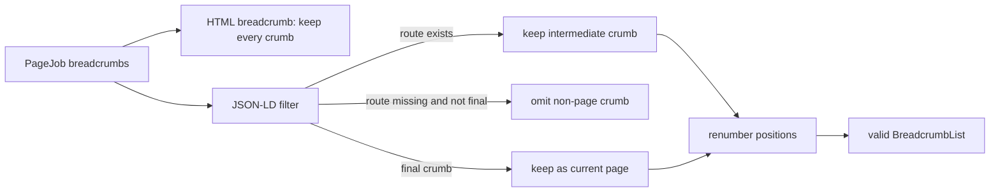

# Breadcrumb structured data — omit non-page intermediate crumbs

## Goal

Remove Google's critical `Missing field "item" (in "itemListElement")` error without changing the visible breadcrumb,
public routes, or prize/category semantics.

Google requires `item` on every `BreadcrumbList` entry except the final entry. The final entry may omit `item`, in
which case Google uses the containing page URL. See Google's
[Breadcrumb structured data specification](https://developers.google.com/search/docs/appearance/structured-data/breadcrumb#list-item).

## Current failure

`website/build.py:2725-2738` keeps a non-routed category in the visible winner breadcrumb. This is intentional: a
year-routed or single-category prize has no category page, but the label still tells the reader what the award was for.

`website/build.py:1852-1870` serializes the same breadcrumb into JSON-LD and adds `item` only when `Breadcrumb.route`
is nonblank. The result on the reported page is:

```text
Home (item) -> Japan Prize (item) -> Earth Science (no item) -> 1990 (item) -> William Jason Morgan (final)
```

`Earth Science` is an intermediate `ListItem`, so its missing `item` is invalid. The final winner entry is valid
without `item`; although its visible link may lead to the laureate's person page, its structured-data identity is the
containing award-recipient page.

A read-only audit of the generated `website/dist/` on 2026-08-03 found 137 affected English winner pages: 116 Japan
Prize pages and 21 Kavli Prize pages. The same pages exist in all four locales, producing 548 invalid generated pages.
These counts describe the current dataset and are not acceptance-test constants.

## Requirements

1. JSON-LD MUST contain only routable intermediate breadcrumbs followed by the final breadcrumb.
2. Every non-final JSON-LD `ListItem` MUST contain an absolute, locale-correct `item` URL.
3. The final JSON-LD `ListItem` MUST retain its name and MAY omit `item`, preserving the current-page meaning required
   when a winner's visible final crumb links to a separate person page.
4. JSON-LD positions MUST be contiguous integers starting at 1 after non-routable intermediate crumbs are removed.
5. Visible HTML breadcrumbs MUST remain unchanged, including non-routed category labels and winner-to-person links.
6. The fix MUST apply through the shared serializer to English, Spanish, French, and Japanese output.

## Design

Filter the structured-data trail immediately inside `_structured_data`; do not change `PageJob.breadcrumbs` or the
HTML render context.



For the reported page, structured data becomes:

```text
1 Home (item) -> 2 Japan Prize (item) -> 3 1990 (item) -> 4 William Jason Morgan (final)
```

The serializer MUST NOT invent a category URL, point the category at the winner or year page, or add a new category
page. Each of those alternatives would make the required field syntactically present while misrepresenting the site
hierarchy.

## Files and changes

| File | Current lines | Required change |
|---|---:|---|
| `datasets/website/build.py` | 1852-1870 | Build the structured breadcrumb sequence from routable intermediate crumbs plus the final crumb, then serialize and renumber that filtered sequence. |
| `datasets/tests/test_build_website.py` | 1477-1623 | Replace the breadcrumb length-only assertion with exact regression coverage proving the non-routable category is absent, positions are contiguous, every non-final entry has `item`, and the final entry has no incorrect person-page `item`. |

No template, stylesheet, catalogue, route planner, database, or generated `website/dist/` file is in scope.

## Verification

1. Run the focused website test containing the structured-data assertions.
2. Run the complete website test module.
3. Build all locales from `datasets/`:

   ```sh
   uv run website/build.py --base-url https://prizeatlas.org/
   ```

4. Parse every generated `BreadcrumbList` and require `item` on every entry except the final entry. The invalid count
   MUST be zero across all locales.
5. Inspect one reported Japan Prize page and one affected Kavli Prize page to confirm the visible category remains
   while the JSON-LD category is omitted.

Generated `website/dist/` remains unversioned. The implementation commit MUST contain only the source and test
changes approved above.
