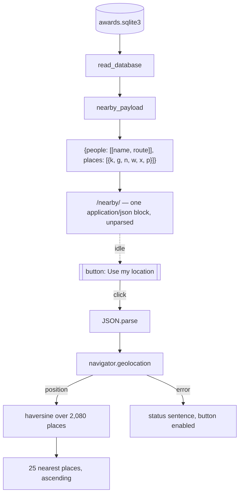

# Winners near me — a nearby page driven by browser geolocation

## Goals

Answer "which award winners are connected to where I am standing right now" — a text list of the nearest recorded
birthplaces and institutions, each naming the laureates attached to it. It MUST live on its own route so that no
geolocation code, and no coordinate payload, is loaded by any visitor who does not ask for it.

## Background

The Explorer already personalises one section: `templates/explorer.html:339-388` looks the visitor's country up over
IP (`https://api.country.is/`) and draws the top 25 laureates born there. That is country-grained, it fires on every
Explorer page load, and it costs a third-party request whether or not the reader cares.

The database carries exact coordinates that nothing on the site uses for proximity. Measured against
`datasets/awards.sqlite3` on 20260729, counting points as parsed float pairs — the same grouping the code will do,
which is why this is 1,443 and not the 1,471 distinct coordinate *strings*:

| Source | Column | Points | (place, laureate) pairs |
|---|---|---|---|
| Birthplaces | `awards.birth_coordinates` | 1,443 | 2,586 |
| Institutions | `awards.affiliation_coordinates` + `award_extra_affiliations.affiliation_coordinates` | 637 | 2,260 |

2,349 of 2,377 laureates sit on at least one of those 2,080 points. Coordinates are stored `"lng,lat"` and are already
parsed and validated by `parse_map_points` (`build.py:501-523`) for the Map page, which plots the same two layers
(`map_payload`, `build.py:534-603`) but offers no "near me" reading of them.

The reference is Wikipedia's `Special:Nearby`: a page you must open deliberately, which asks for location on a click
and answers with a plain text list ordered by distance.

## Assumptions

1. **(load-bearing)** The visitor's position comes from `navigator.geolocation` only, on an explicit click, or from an
   `#at=` fragment they typed themselves. No IP fallback: the Explorer's country lookup stays as it is, and this page
   makes no network request at all.
2. **(load-bearing)** Both layers are listed, each row tagged with its kind — "Born here" for a birthplace, "Worked
   here" for an institution. This mirrors the Map's two layers and is the only way a city yields a useful list.
3. **(load-bearing)** A row is a **place**, not a person. At 42.3744,-71.1169 Harvard alone holds 78 laureates; a
   person-per-row list standing in Cambridge would be 50 identical distances. Each place row names its laureates.
4. **(load-bearing)** The payload is embedded in the page as one `application/json` block, exactly as the Explorer
   (`explorer.html:220`) and Map do. Estimated ~160 KB against the Explorer's 418 KB and the Map's 541 KB as built
   today. Fetching it separately after permission is granted is the rejected alternative — see Notes.
5. Identity is `laureate_wikidata_qid` when present, else `f"row:{award_record_id}"` — the key `explorer_payload`
   already builds (`build.py:427`), which keeps two unrelated blank-QID rows from merging on a shared name. A laureate
   with three awards at one institution appears there once. Every row carrying coordinates today has a QID, so every
   listed name links to its person page; the blank-QID branch is kept anyway, as `explorer_payload:433-435` keeps it.
6. **(load-bearing)** One point often carries several names, and they are **not** always spellings of one place. At
   `-122.2865,37.8314` the records name Chiron, Cetus **and Pixar**; at `-0.1278,51.5074`, five unrelated London
   institutions including Marconi Wireless. 37 institution points and 104 birthplaces are like this. The commonest
   name leads the row, and the count of the others is shown — never silently dropped, which would attribute a Pixar
   laureate to Cetus. `map_payload` already ships this count as `extra_labels` (`build.py:586`).
7. Distances are straight-line kilometres. No miles, no unit toggle, no travel time — see Notes for the dissent.
8. No coordinate is filtered. Nothing blocklisted or blank-named carries coordinates today (verified: 0 rows), so
   `AFFILIATION_BLOCKLIST` is not consulted and no coupling to it is created.
9. The page is indexed and joins the sitemap like any other job route. Before the click it is prose, a button and
   links to the Map and Countries pages — a thin page, honestly. It is not an SEO target and MUST NOT be padded into
   one by pre-rendering a list nobody asked for.

## Scope

One new page, one new template. ~315 LOC across 5 files, 4 of them existing.

| File | Change | LOC |
|---|---|---|
| `datasets/website/templates/nearby.html` | new — scoped CSS, markup, geolocation and render script | ~180 |
| `datasets/website/build.py` | `NEARBY_ROUTE`, `TEMPLATES` entry, `nearby_payload`, page job, two render contexts, `llms.txt` | ~70 |
| `datasets/tests/test_build_website.py` | payload grouping, labels, other-name counts, route, entry points | ~60 |
| `datasets/website/templates/explorer.html:152` | link out of the country section | +3 |
| `datasets/website/templates/base.html:30` | nav item after Map | +1 |

`static/style.css` is **not** touched: `explorer.html` and `map.html` both carry page-specific CSS in
``, and this page follows them. What it can reuse from the global sheet, it reuses — `.rank-units`
and `.rank-units-more` (`style.css:335-385`) carry the laureate names and the disclosure verbatim.

## Routes

```
/nearby/            new — the only page carrying the coordinate payload
```

## Design



Until the button is clicked the payload is inert text in the DOM: the script binds one handler and stops. Parsing
~160 KB costs 30-60 ms on a mid-range phone, and it belongs behind the interaction, where it is invisible.

The visitor's coordinates never leave the browser — there is no request to make, because the whole dataset already
arrived with the page, and the override is a fragment, which is never sent.

### `NEARBY_ROUTE` — build.py, beside the other route constants

```python
NEARBY_ROUTE = "/nearby/"
```

after `EXPLORER_ROUTE` (`build.py:82`). `"nearby.html"` joins `TEMPLATES` after `"explorer.html"` (`build.py:62`).

### `nearby_payload` — build.py, after `map_json` (`build.py:606-607`)

```python
def nearby_payload(records: list[AwardRecord], routes_by_laureate: dict[str, str]) -> dict[str, Any]:
    """Every coordinate on record, grouped into places, each carrying the laureates attached to it.

    One entry per place, not per award: a laureate with three awards at one institution is listed there once. People
    are listed once in `people` and referenced by index, which is worth roughly 120 KB on a page aimed at a phone.
    """
```

It walks `records` once, and for each non-blank `birth_coordinates` and each `record.affiliations` entry with
non-blank `coordinates` calls `parse_map_points(..., multiple=False)[0]` — the same validation the Map already
performs, so a bad coordinate fails the build in exactly one place.

| Key | Meaning |
|---|---|
| `people` | `[[full_name, route], ...]`, sorted by `(full_name, identity key)`; `route` is `relative_route(NEARBY_ROUTE, ...)`, or `""` without a QID |
| `places[].k` | `"b"` birthplace, `"a"` institution |
| `places[].g` | `[lng, lat]` — source order, as `parse_map_points` returns it |
| `places[].n` | headline: the commonest institution name, or the birthplace's city |
| `places[].w` | where: `"City, Country"` for an institution, `"Country"` for a birthplace; `""` if neither is recorded |
| `places[].x` | how many *other* names are recorded at this point, `0` for most (Assumption 6) |
| `places[].p` | indices into `people`, sorted by `(full_name, identity key)` |

Splitting the label into `n` and `w` is what makes the row readable at 320px — a joined
`"Harvard University, Cambridge, United States"` wraps mid-name with no seam — and it is *smaller* than the joined
string, since the `", "` glue disappears. Where an institution has no name, `n` falls back to the city and `w` to the
country; `_map_display_label` (`build.py:526-531`) spells the same fallback order for the Map.

The headline is the commonest name at that point,
`min(counter.items(), key=lambda item: (-item[1], item[0]))` — the same rule and tie-break as `build.py:579` — and
`x` is `len(counter) - 1`, as `build.py:586`.

Every ordering is explicit, because these bytes must not depend on SQL row order: `SELECT ... FROM awards`
(`build.py:651`) has no `ORDER BY`, so an insertion-ordered `people` array would make two builds of identical data
differ. Places are emitted `sorted(places.items())` — by kind, then point — and both `people` and each `places[].p`
sort by `(full_name, identity key)`; the key breaks the tie two identically-named blank-QID rows would otherwise
leave to insertion order.

### Serialisation

`map_json` (`build.py:606-607`) already spells this call, and it is reused as-is — its `<`-escaping is the property
that matters, and a second identical serializer beside it is not worth the keystrokes. Its annotation widens to
`dict[str, Any]` to admit this payload. It MUST NOT be renamed: `tests/test_build_website.py:332` calls it by name.

### Page job — build.py, after the Explorer job (`build.py:1896-1906`)

```python
payload = nearby_payload(records, routes_by_laureate)
jobs.append(
    _page(
        "nearby.html",
        NEARBY_ROUTE,
        "Award Winners Near You",
        "Find the laureate birthplaces and institutions closest to you, ranked by distance, using your browser's location.",
        (Breadcrumb("Home", "/"), Breadcrumb("Nearby", None)),
        payload=map_json(payload),
        places=len(payload["places"]),
        laureates=len(payload["people"]),
    )
)
```

The two totals are read off the payload the job is already building — never typed in. They put the page's own
coverage in its footnote (2,080 and 2,349 as of 20260729) rather than promising a completeness it does not have.

### Render contexts — build.py:2136-2137 and build.py:2168-2169

Both `_render_job` and `render_error_page` gain `nearby_route=NEARBY_ROUTE`. Both are mandatory, and they are also
sufficient: all 23 templates extend `base.html`, and `base.html` is reached from exactly these two `.render()` calls
— `404.html:1` extends it too, which is why the error page needs the key. `StrictUndefined` (`build.py:2109`) turns a
missed one into a build failure rather than a blank href.

### `llms.txt` — build.py:2096

The Bulk data section says "These two pages"; it becomes three, with a bullet naming
`<script id="nearby-data" type="application/json">` and its `people` / `places` shape.

### The page — templates/nearby.html

```html
<header class="page-intro">
  <p class="eyebrow">Nearby</p>
  <h1>Award winners near you</h1>
  <p>The recorded birthplaces and institutions closest to wherever you are.</p>
</header>

<section class="locate">
  <button id="locate" type="button">Use my location</button>
  <p id="status" role="status"></p>
  <p class="privacy">Your position stays in this browser. The whole dataset already arrived with this page, so there is nothing to send.</p>
</section>

<h2 id="near-h" tabindex="-1" hidden>Near you</h2>
<ol id="near-list" class="near-list"></ol>

<p class="footnote">2,080 places and 2,349 laureates carry coordinates. Every place is on the <a>Map</a>; every country is under <a>Countries</a>.</p>
```

The button and the status line sit **outside** `.page-intro` on purpose: `.page-intro > p:not(.eyebrow)`
(`style.css:161-164`) sets 1.125rem, which would render "Location not shared" larger than the body text. The privacy
line is a plain muted `<p>`, **not** `.caveat` (`style.css:274-284`) — that class means "this data is incomplete"
on six other pages, and diluting it to mean "we respect you" costs more than it buys.

#### Row anatomy

At 320px, `main` is 288px wide. Five fields on one line do not fit — `.rank-list`'s
`2.5rem | 1fr | 6rem` grid (`style.css:324-331`) would leave ~120px, about 16 characters, for a label like
"Konrad-Lorenz-Institut der Österreichischen Akademie der Wissenschaften". So the row stacks, and becomes two columns
only at ≥40rem:

```
0.8 km · ● Worked here            .near-meta   .8125rem, muted, tabular-nums
Harvard University                .near-name   1.0625rem, weight 500
Cambridge, United States          .near-where  .875rem, muted
Roald Hoffmann, Walter Gilbert,   .rank-units  reused from style.css:335
Jack Szostak, Eric Maskin
+ 74 more                         .rank-units-more, reused from style.css:350
```

Three deletions from the first draft, each earned: **no ordinal** (it is an `<ol>` and the distances are monotonic),
**no laureate count on the row** (about 1,527 of 2,080 places hold exactly one laureate — the name *is* the count;
on the 83 rows that disclose, `+ 74 more` carries the arithmetic), and **no badge for the kind**. The dot before "Worked
here" takes its two colours from the Map's own vocabulary — `--birth: #9a6035`, `--institution: #346d76`, with the
dark-scheme pair at `map.html:24-26` — so the two geographic pages speak one language.

The inline name cap is **4**, not 8: eight names wrap to about five lines at 288px, and the rows where that happens
are the dense city-centre rows a reader is most likely to be standing in. The remainder folds into
`.rank-units-more`, whose triangle is already suppressed and whose "+ N" already carries the affordance.

#### Script

1. **Click, then nothing sooner.** `JSON.parse` and `getCurrentPosition` are both reached from the button handler
   only. The override `#at=<lat>,<lng>` renders immediately without prompting — it is how the page is tested and how
   a result is shared. It MUST be a fragment, not the query string the Explorer uses for `?country=`
   (`explorer.html:340`): a query is sent to the server and lands in its access log, and a coordinate pair is not a
   country. Note the fragment is `lat,lng` while `places[].g` is `[lng,lat]`; two orders in one feature is exactly
   the kind of thing that must be written down.
2. **The fragment is validated.** `Number.isFinite` on both numbers, `|lat| ≤ 90`, `|lng| ≤ 180`. Otherwise it is
   ignored and the page waits for the button — an unguarded `NaN` sorts arbitrarily and renders 25 rows of "NaN km",
   which is the silence rule 6 forbids. When a valid fragment *is* used, the status line says so: *"Showing places
   near 42.37, −71.12 — from the address bar, not your location."* A shared link must not look like a page that read
   the recipient's position.
3. **Guards before the API.** `window.isSecureContext && navigator.geolocation`, else the button is `.remove()`d —
   not disabled — and the status line says the browser cannot share a location and points at the Map. A permanently
   greyed button is dead furniture that readers keep clicking.
4. Options `{ timeout: 10000, maximumAge: located ? 0 : 300000 }`. `enableHighAccuracy` is left at its default
   `false`: street accuracy is pointless against city-centre coordinates. The `located` ternary is what makes a
   second click do something — with a flat 5-minute cache it would re-render an identical list instantly and read as
   broken.
5. **The status sentence is set _before_ `getCurrentPosition` is called**, not in the callback. On iOS the permission
   sheet covers the page entirely; the sentence must already be there when it dismisses.
6. **Every failure is a sentence**, and the button returns to `Use my location`:

   | State | Button | Status |
   |---|---|---|
   | resting | `Use my location` | (empty, height reserved) |
   | pending | disabled, `aria-busy="true"` | `Waiting for your browser to share a location…` |
   | success | `Update my location` | `25 places within 9.7 km. Nearest: Harvard University.` |
   | denied (`code 1`) | enabled | `Location not shared — nothing was sent anywhere. You can try again from the padlock in the address bar, or open the Map.` |
   | unavailable (`code 2`) | enabled | `Your device could not work out where it is. Try again in a moment, or open the Map.` |
   | timeout (`code 3`) | enabled | `That took too long. Try again — a second attempt is usually faster.` |

   The button label changes exactly once, on first success. Everything else moves through the status line, so there
   is one channel and not two. `#status` reserves `min-height: 1.6em` so the list does not jump when a sentence
   first appears.
7. Distance is the haversine, `2R·atan2(√a, √(1−a))` with R = 6371 km — the `asin(√a)` form returns `NaN` when float
   error pushes `a` past 1. No antimeridian handling and no bounding-box prefilter: 2,080 haversines is microseconds,
   and the wrap is correct by construction. Formatting has two buckets — `under 1 km`, then one decimal below 10,
   then whole kilometres with `toLocaleString("en")` above. There is no metres bucket: a cached wifi fix is routinely
   1-5 km off, so `820 m` is false precision and `0 m` is a claim the API cannot support.
8. The 25 nearest render ascending. `Array.prototype.sort` is stable and `sorted(places.items())` puts `"a"` before
   `"b"`, so where a birthplace and an institution share a coordinate — 14 do — the institution leads. A laureate
   recorded at several points in one city appears in several rows; that is accurate, and no dedup is built.
9. **When the nearest place is beyond 500 km**, the heading reads `Closest anywhere` instead of `Near you` and the
   status says `Nothing recorded near you — the closest is 4,363 km away.` The list still renders; only the claim
   changes. From Point Nemo every row is a hemisphere away, and "Near you" over that list is simply false.
10. **Escaping is mandatory.** Names and labels reach the DOM through `innerHTML`, so they pass through the same
    `esc` helper spelled at `explorer.html:231`. A laureate with no person page renders as text, not `<a href="">`,
    mirroring `explorer.html:279`.
11. Accessibility: `#status` is `role="status"` and carries the announcement. `#near-list` MUST NOT be
    `aria-live` — a live region here would read 25 rows and up to 93 links aloud on every render. On success the
    `<h2>` is unhidden and focused (`tabindex="-1"`), so keyboard and screen-reader users land on the result.

### Entry points

- `base.html:30` — a `Nearby` nav item after `Map`. `.site-nav` is already `flex-wrap: wrap` (`style.css:87-93`) and
  already wraps to two lines at 320px with seven items; an eighth degrades rather than overflows.
- `explorer.html:152` — inserted **after** `<figure id="local-winners-chart">`, as
  `<p class="section-note"><a href="{{ href(nearby_route) }}">Find the winners nearest you</a></p>`. It MUST NOT go
  inside `#local-winners-note` (`explorer.html:151`), whose `textContent` is reassigned on both the success and the
  failure path of the country lookup — the link would vanish a second after load, on every visit. No arrow: the site
  reserves `↗` for external links and `→` for pagination. The Explorer gains a link and nothing else — no script, no
  payload, no geolocation prompt.

## Behavior / Acceptance

Scenarios marked **(manual)** are browser behaviour; the repository has no browser-test tooling and this change does
not add any. They are checked by hand against `startdev.sh`, per Verification. Everything else is pytest.

### Requirement: the page MUST NOT read the visitor's location, or parse its payload, before they ask

#### Scenario: page load (manual)
- WHEN a visitor opens `/nearby/` with no fragment
- THEN no permission prompt appears, no distance is computed and no list is rendered
- AND no network request is made beyond the page, its stylesheet and its favicon

#### Scenario: the Explorer is unchanged
- WHEN a visitor opens `/explorer/`
- THEN it carries no geolocation call and no coordinate payload
- AND its country section links to `/nearby/`, outside the paragraph the country lookup overwrites

### Requirement: granting permission MUST list the nearest places, ascending

#### Scenario: a position in Cambridge, Massachusetts (manual)
- WHEN the page is opened at `#at=42.3744,-71.1169`
- THEN Harvard University leads at `under 1 km`, tagged "Worked here", naming 4 laureates and `+ 74 more`
- AND the following rows are in non-decreasing distance order, at most 25 of them
- AND the status states the count, the farthest distance, and that the position came from the address bar

#### Scenario: a position far from everything (manual)
- WHEN the page is opened at `#at=-48.876,-123.393`
- THEN the heading reads `Closest anywhere`, not `Near you`
- AND the status states that nothing is recorded nearby and gives the distance to the closest

#### Scenario: an unusable fragment (manual)
- WHEN the page is opened at `#at=abc`
- THEN no list renders, no row reads `NaN`, and the button is offered as normal

#### Scenario: one laureate, several awards, one institution
- WHEN a laureate holds three awards recorded at the same institution
- THEN that institution's place names them once

#### Scenario: a point holding several institutions
- WHEN the payload is built for `-122.2865,37.8314`, recorded as Chiron, Cetus and Pixar
- THEN the place's `n` is the commonest of the three and its `x` is 2
- AND the row shows the other-name count rather than attributing every laureate to one of them

#### Scenario: a rebuild is byte-identical
- WHEN the payload is built twice from the same database
- THEN the serialised bytes are equal, whatever order the rows arrived in

### Requirement: every failure MUST be stated in a sentence

#### Scenario: permission refused (manual)
- WHEN the visitor denies the prompt
- THEN the status line says the location was not shared and nothing was sent, no list renders, and the button is
  clickable again

#### Scenario: no geolocation available (manual)
- WHEN the page runs outside a secure context, or the browser has no geolocation
- THEN the button is removed from the page and the status line says so, pointing at the Map

### Requirement: laureate names MUST be escaped

#### Scenario: a name carrying markup characters
- WHEN a laureate name contains `<`, `&` or `"`
- THEN it renders as text, not as markup

### Requirement: the build MUST carry the new route

#### Scenario: a full build
- WHEN the site is built
- THEN `dist/nearby/index.html` exists and holds one `application/json` block with `people` and `places`
- AND the sitemap carries `/nearby/`, `llms.txt` names it, and the page count is one higher than before

## Verification

```
cd datasets && uv run -m pytest tests/test_build_website.py
cd datasets && uv run website/build.py --base-url https://example.org/awards/
./startdev.sh 8000                      # then http://localhost:8000/nearby/
```

The (manual) scenarios are walked there, in this order: load with no fragment and confirm in the Network panel that
the page, its stylesheet and its favicon are the only requests; click and grant; click again and confirm the list
refreshes; click and deny; then `#at=42.3744,-71.1169` and `#at=-48.876,-123.393` and `#at=abc`. `localhost` is a
secure context, so the real button — not only the fragment — is exercisable locally. Confirm the rendered
`dist/nearby/index.html` against the ~160 KB estimate in Assumption 4; a wild miss means the payload shape drifted.

## Notes — not in scope

- **Miles.** The reviewer's dissent from Assumption 7, recorded because it is a fair one: 22 of the 25 rows a
  Honolulu reader sees are `3,850 km`+, and this dataset's largest audience is American. A `navigator.language` sniff
  (`en-US`, `en-LR`, `my-MM` → miles) is about six lines with no button and no stored state, and would be the way to
  do it. It was not asked for, and the site carries no other units today.
- **Fetching the payload after permission.** Writing `nearby.json` into `dist/` and fetching it inside the success
  handler would defer ~160 KB until the visitor actually consents. It costs a second delivery mechanism, a relative
  path join and a fetch failure branch, for one page. Parsing behind the click already moves the cost that matters;
  revisit if the payload grows.
- **A shared `_coordinate_rows` generator for `map_payload` and `nearby_payload`.** The second parse pass and the
  duplicated label tie-break are real duplication, and a change to the label rule that lands in one builder would
  make `/map/` and `/nearby/` name the same point differently. It is a refactor of working code that was not asked
  for; flagged here rather than folded in.
- **A pre-rendered list of the densest places for the pre-click state.** It would fill the page before the click and
  give no-JS readers something, but it means the same list rendered twice, once in Jinja and once in JS. Assumption 9
  takes the thin page instead.
- **A gap marker in the list.** From Honolulu, rows 4-25 jump from 26 km to 3,850 km; Perth and Nairobi behave the
  same way. A `then a jump of 3,824 km` separator would be honest, but every row already prints its distance, so the
  cliff is visible without new furniture.
- **A radius filter, a place-name search box, and a "near me" control on the Map.** None were asked for.
- Some birthplaces carry a city-centre coordinate rather than the exact place — 93 laureates sit on the single New
  York City point, and one of them is recorded as born in Amherst. It is a data problem, visible on the Map already,
  and this page neither creates nor fixes it.
- `website/templates/country_views.html` is tracked, extends `base.html`, is in no `TEMPLATES` entry and is rendered
  by nothing. Noted while auditing render contexts; already flagged for deletion by the country-tabs spec.
