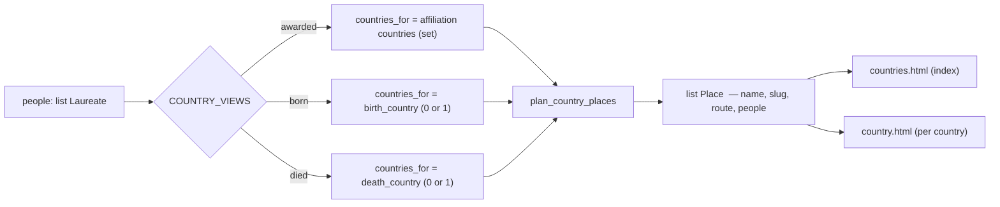

# Country ranking tabs — Awarded, Born, Died

## Goals

Rank countries three ways instead of one. `/countries/` answers only "where were laureates born"; it must also answer
"where were they when the award was made" and "where did they die". Each view MUST be a peer tab with its own ranked
list and its own per-country pages.

## Background

`/countries/` today is a single ranked list of birth countries (`templates/countries.html`), built by `plan_places`
(`build.py:827-865`), which groups laureates on the first non-blank `birth_country` across their award records. Each
row links to `/countries/{slug}/` (`templates/country.html`), listing that country's laureates.

A second tab already exists — Institutions, at `/countries/affiliations/` — but it ranks countries by *distinct
institutions*, not by people. The two-tab bar is the shared `view_tabs` macro (`templates/_view_tabs.html:1-7`), which
`subject.html:4` and `subject_affiliations.html:4` also use for the unrelated Subjects People/Institutions split.

The database already carries everything needed. Measured against `datasets/awards.sqlite3` on 20260728, over 2,374
distinct laureates:

| View | Source field | Laureates covered | Countries |
|---|---|---|---|
| Awarded | `affiliation_country` (both affiliation stores) | 2,041 | 42 |
| Born | `birth_country` | 2,332 | 92 |
| Died | `death_country` | 1,291 | 52 |

Awarded is the only multi-valued view: 2,090 total row-memberships for 2,041 laureates, because a laureate with awards
recorded at institutions in two countries belongs to both.

## Assumptions

1. **(load-bearing)** "Awarded in" means the country recorded on an award's affiliation row — the institution the
   laureate was at when the award was made. There is no separate ceremony-location field.
2. **(load-bearing)** A laureate is counted once per country per view, never once per award. This is the existing rule
   for Born (`build.py:833-836`) and MUST hold for all three views. Awarded therefore counts a laureate in every
   distinct country they were recorded at; its column does not sum to the laureate total.
3. **(load-bearing)** `/countries/` keeps serving Born. It is already indexed and linked from `index.html:11-12`,
   `base.html:28`, `about.html:72`, and `person.html:8`; those URLs MUST NOT change.
4. Awarded counts every affiliation row with a non-blank country, whether or not the institution is named. Only 4 rows
   (3 laureates) have a country but a blank or blocklisted name, so restricting to named institutions would change
   nothing except add a coupling to `AFFILIATION_BLOCKLIST`.
5. Born and Died take the first non-blank value across a laureate's award records, matching today's Born behaviour.
   Conflicting values across a laureate's records are a data problem, not a rendering one.
6. The Institutions tab keeps its current meaning and route. It joins the same tab row as a fourth peer.
7. The `view_tabs` macro stays as-is because Subjects depends on it. Countries gets its own macro.
8. Prose copy per view lives in `build.py`, alongside the page titles and descriptions that already live there
   (`build.py:1486-1490`), not in `` branches in the templates. It travels as ordinary `_page(...)` kwargs —
   the road `title` and `description` already travel — so no carrier dataclass is needed.
9. Tab order is the life arc: **Born, Awarded, Died**, then Institutions. Born leads because `/countries/` is the
   landing route linked from `base.html:28`. This orders the four differently from the tab set as first sketched
   (Awarded first); the set, routes, and default view are unchanged.

## Scope

96 new static pages. Roughly 125 LOC changed across 9 existing files. No new files.

| File | Change | LOC |
|---|---|---|
| `datasets/website/build.py` | view table, generalized planner, `plan_places` rename, page jobs, render context, reserved slugs | ~85 |
| `datasets/website/templates/_view_tabs.html` | new `country_tabs` macro; `view_tabs` untouched | +9 |
| `datasets/website/templates/countries.html` | copy and tab state from context | ~6 |
| `datasets/website/templates/country.html` | copy and tab state from context | ~6 |
| `datasets/website/templates/affiliation_countries.html` | swap to `country_tabs` | 1 |
| `datasets/website/templates/affiliation_country.html` | swap to `country_tabs` | 1 |
| `datasets/website/templates/about.html:72` | copy: three country views, not one | ~2 |
| `datasets/website/static/style.css` | `flex-wrap` guard, right-align the Institutions tab, plain Died counts | ~8 |
| `datasets/tests/test_build_website.py:878` | the People tab is now Born — assertion must follow | 1 |

`tests/test_build_website.py:878` asserts `'href="../">People</a>'` against `/countries/affiliations/` and MUST be
updated. Line 999 is the same assertion against the **Subjects** tab bar and MUST NOT be touched — `view_tabs` is
unchanged there.

## Routes

```
/countries/                          Born      index      (unchanged)
/countries/{slug}/                   Born      detail     (unchanged, 92 pages)
/countries/awarded/                  Awarded   index      (new)
/countries/awarded/{slug}/           Awarded   detail     (new, 42 pages)
/countries/died/                     Died      index      (new)
/countries/died/{slug}/              Died      detail     (new, 52 pages)
/countries/affiliations/             Institutions         (unchanged)
/countries/affiliations/{slug}/      Institutions         (unchanged)
```

Born detail pages sit directly under `/countries/`, so a Born country slug MUST NOT collide with a sibling segment.
`build.py:861-862` guards only against `affiliations` today; the guard becomes a reserved-segment set covering
`affiliations`, `awarded`, and `died`. Awarded and Died detail pages live under their own prefix and cannot collide.

## Design



One planner, three membership functions. `Place` (`build.py:253-258`) is reused unchanged for all three views.

### The view table — build.py, beside the other route constants (~line 70)

No carrier dataclass. A view is a label and a route; the label is also the tab state and the dict key, and the eyebrow
is `f"{label} in"` — which reproduces today's "Born in" (`countries.html:6`, `country.html:6`) verbatim.

```python
COUNTRY_VIEWS = (
    ("Born", COUNTRIES_ROUTE),
    ("Awarded", "/countries/awarded/"),
    ("Died", "/countries/died/"),
)
RESERVED_COUNTRY_SEGMENTS = frozenset({COUNTRY_AFFILIATIONS_SEGMENT, "awarded", "died"})
```

`RESERVED_COUNTRY_SEGMENTS` replaces the single-segment guard at `build.py:861-862`, reusing the existing
`COUNTRY_AFFILIATIONS_SEGMENT` constant (`build.py:70`, still live at `build.py:1077`) rather than respelling
`"affiliations"`.

### `plan_country_places` — build.py, replacing the country half of `plan_places` (`build.py:842-865`)

```python
def plan_country_places(people: list[Laureate], route: str,
                        countries_for: Callable[[Laureate], Iterable[str]]) -> list[Place]:
```

`Callable` is not imported today; add it to the existing `from collections.abc import Iterable` line (`build.py:24`).

It groups laureates by the countries `countries_for` yields, slugs each country, raises `BuildFailure` on a duplicate
slug or a `RESERVED_COUNTRY_SEGMENTS` collision, sorts members by `_surname_key`, and sorts places by
`(-len(people), name)` — the existing rules, unchanged.

The reserved check is unconditional. It only *has* to hold for Born, whose details sit at `/countries/{slug}/`, but
making it a parameter buys one defaulted argument with one non-default caller. If a country ever did slug to
`awarded`, failing all three views is the outcome you want anyway.

The three membership functions are module-level and named `_born_countries`, `_awarded_countries`,
`_died_countries` — one expression each, per the table above.

`plan_places` keeps only its affiliation half. A function called `plan_places` that plans no places is worse than the
churn of renaming it, so it becomes `plan_affiliations(records, record_routes, profiles_by_qid) -> list[Affiliation]`,
losing the `people` argument and the first two paragraphs of its docstring (`build.py:833-841`), which are entirely
about ranking birth countries. It has one call site (`build.py:1431`) and no test imports it —
`tests/test_build_website.py` drives everything through `build.build_site` — so the rename is free.

```python
affiliations = plan_affiliations(records, all_record_routes, profiles_by_qid)
country_places = {label: plan_country_places(people, route, MEMBERS[label]) for label, route in COUNTRY_VIEWS}
countries = country_places["Born"]
```

The `countries` binding is kept deliberately: `build.py:1714` (About-page total) and `build.py:1731`
(`SitePlan.country_count`) already read it and MUST keep meaning the Born places, so the reported country count does
not silently change meaning.

Membership functions, each one expression:

| key | rule |
|---|---|
| `awarded` | `{a.country.strip() for r, _ in p.awards for a in r.affiliations if _nonblank(a.country)}` |
| `born` | first non-blank `record.birth_country` across `p.awards`, as a 0- or 1-element tuple |
| `died` | first non-blank `record.death_country` across `p.awards`, as a 0- or 1-element tuple |

`countries` at `build.py:1714` and `build.py:1731` (the About-page total and `SitePlan.country_count`) continues to
mean the Born places, so the reported country count does not silently change meaning.

### Page jobs — build.py, replacing `build.py:1482-1509`

One loop over `COUNTRY_VIEWS` emitting the index page and, nested, its detail pages. Both get `tab=label` and
`eyebrow=f"{label} in"`; the index also gets `blurb` and `caveat`, and each detail page gets its own `blurb` as an
f-string over that place — which is how `country.html:8`'s per-country count ("N laureates on record were born here")
survives the generalization instead of being flattened into one static sentence.

Breadcrumbs: Born keeps `Home > Countries > {name}`; Awarded and Died use `Home > Countries > {label} > {name}`, with
the Countries crumb pointing at `COUNTRIES_ROUTE`.

Index blurbs MUST carry the view's country count and laureate coverage — 92, 42, 52 countries, and 2,332 / 2,041 /
1,291 laureates. Switching tabs otherwise halves the list with no explanation. `build.py:1487-1489` already computes
these numbers for the meta description; the change surfaces them in the visible blurb too.

Two caveats are not optional:

- **Awarded MUST state that its column does not sum to the laureate total.** The Born tab beside it promises "Every
  laureate counted once" (`countries.html:8`), and Awarded breaks that rule by design (2,090 memberships for 2,041
  laureates). Two peer tabs making contradictory counting claims with no note is how a careful reader stops trusting
  the numbers.
- **Died MUST state that living laureates appear nowhere** — 1,291 of 2,374 are on it — and that a country of death is
  often incidental (retirement, travel, exile), making it the weakest of the three signals.

### Tab bar — templates/_view_tabs.html

A new `country_tabs(current)` macro loops over `country_views` for the three people tabs and appends the Institutions
anchor, with `aria-label="Country views"` rather than the generic "Views" of `_view_tabs.html:2`. It reads routes from
the global render context, so `build.py:1818-1825` and `build.py:1849-1856` each gain `country_views=COUNTRY_VIEWS`
alongside the existing `country_affiliations_route`. `view_tabs` is left exactly as it is for `subject.html` and
`subject_affiliations.html`.

No `|` separators between the four. Three pipes plus their gaps add roughly 70px to a row that has only ~18px of slack
at a 320px viewport (see CSS below); the gap and the accent underline already separate the items.

### CSS — static/style.css

Three small rules; the spec's earlier claim that no CSS change was needed does not survive measurement.

1. `.view-tabs` (`style.css:286-291`) has no `flex-wrap`. Flex items default to `min-width: auto` and single words
   have no break opportunity, so an overflowing row spills out of `<main>` and scrolls the page horizontally instead
   of wrapping. The four labels measure ~210px plus 3 × 1.25rem gaps = ~270px against a 288px `main` at a 320px
   viewport (`style.css:60`) — it fits, barely. Add `flex-wrap: wrap` as a guard against large user font sizes.
   Wrapping does misplace the active tab's accent bar, which relies on the container's `border-bottom` and
   `margin-bottom: -1px` (`style.css:290, 303-305`) — acceptable for a rule that should never fire.
2. The fourth tab changes axis: three rank people, one ranks institutions. Push it right with
   `.view-tabs .tab-alt { margin-left: auto; }`, the same device `.site-nav` already uses at `style.css:92`. It marks
   the change without a pipe, a rule, or a word, and collapses to zero when space runs out.
3. The Died index MUST NOT draw the share-of-leader bar. `.rank-count::after` (`style.css:371-380`) renders a
   progress bar against the leader; on Died that is a league table of deaths with `#1 United States 627` winning.
   The index passes `rank-list rank-list-plain` and the stylesheet gains
   `.rank-list-plain .rank-count::after { content: none; }`. The numbers still rank; the competitive framing goes.

### Templates

`countries.html` and `country.html` are shared by all three views. The hardcoded "Born in" eyebrow and birthplace prose
(`countries.html:6-10`, `country.html:6-8`) become `{{ eyebrow }}`, `{{ blurb }}`, and ``, and the tab
call becomes `country_tabs(tab)`. `affiliation_countries.html:4` and `affiliation_country.html:4` switch to
`country_tabs("Institutions")`.

## Behavior / Acceptance

### Requirement: Four tabs — every country page MUST show Awarded, Born, Died, Institutions, with the current one marked

#### Scenario: landing on the born view
- WHEN a reader opens `/countries/`
- THEN the tab row shows Awarded, Born, Died, Institutions in that order
- AND Born carries `aria-current="page"`
- AND the ranked list is unchanged from before this change

#### Scenario: subjects are unaffected
- WHEN a reader opens a subject page
- THEN it still shows exactly the two tabs People and Institutions

### Requirement: Awarded MUST rank countries by laureates recorded at an institution there

#### Scenario: multi-country laureate
- WHEN a laureate has awards recorded at institutions in two countries
- THEN they appear once in each country's list
- AND the sum of the Awarded column (2,090) exceeds the covered laureate count (2,041)

#### Scenario: index totals
- WHEN the Awarded index is built
- THEN it lists 42 countries, led by United States with 1,196

### Requirement: Died MUST rank countries by laureates whose death country is recorded

#### Scenario: index totals
- WHEN the Died index is built
- THEN it lists 52 countries covering 1,291 laureates, led by United States with 627
- AND laureates with no recorded death country appear in no row

### Requirement: existing URLs MUST NOT change

#### Scenario: born routes
- WHEN the site is built
- THEN `/countries/` and every `/countries/{slug}/` resolve exactly as before
- AND `/countries/affiliations/` and its children keep their routes and their institution ranking unchanged; only the
  shared country tab row changes on those pages

### Requirement: a reserved segment MUST fail the build, not shadow a page

#### Scenario: colliding country name
- WHEN a Born country slugs to `awarded`, `died`, or `affiliations`
- THEN the build raises `BuildFailure` naming the slug and the country

## Verification

```
cd datasets && uv run website/build.py --base-url https://example.org/awards/    # generated_pages up by 96
```

Then confirm `/countries/awarded/`, `/countries/died/`, `/countries/awarded/united-states/`, and
`/countries/died/united-states/` exist under `dist/`, that `/countries/index.html` is byte-identical to the previous
build apart from the tab row, and that the sitemap carries the 96 new routes.

## Notes — not in scope

- `templates/country_views.html` is dead: it is absent from `TEMPLATES` (`build.py:41-64`) and no job renders it. It is
  a stale copy of the two-tab bar this change supersedes. Flagged for deletion in a separate commit, not touched here.
- `person.html:8` links a laureate's birth country to `/countries/{slug}/`. Linking their death country to the Died
  view is a natural follow-up but was not requested.
